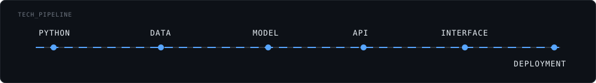
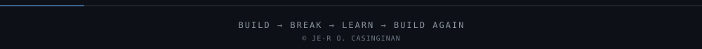

<div align="center">



<br/>

<a href="#project-lab"></a>
<a href="[YOUR_PORTFOLIO_URL]"></a>
<a href="#contact"></a>

<sub>&nbsp;</sub>
<br/>
<sub><a href="#about">About</a> · <a href="#tech-stack">Stack</a> · <a href="#project-lab">Projects</a> · <a href="#labs">Labs</a> · <a href="#contact">Contact</a></sub>

</div>

<br/>

## About

I'm a BSIT student and developer who enjoys turning ideas into working systems from AI/ML experiments and computer vision to full-stack applications, cybersecurity, and interactive 3D web experiences.

`Learn → Build → Break → Understand → Improve → Repeat.`

<br/>

<table>
<tr><td>

```
ROLE          BSIT STUDENT / DEVELOPER
STATUS        ● BUILDING
FOCUS         AI / SOFTWARE / SECURITY
CURRENT MODE  LEARNING + SHIPPING
LOCATION      PHILIPPINES
```

</td></tr>
</table>

<br/>

## What I Build

<table>
<tr>
<td width="25%" valign="top">

**AI / ML**

- Machine learning
- Data processing
- Model experimentation
- Explainable AI

</td>
<td width="25%" valign="top">

**Software**

- Full-stack applications
- REST APIs
- Database systems
- Automation

</td>
<td width="25%" valign="top">

**Computer Vision / 3D**

- Image processing
- Three.js / WebGL
- React Three Fiber
- Interactive interfaces

</td>
<td width="25%" valign="top">

**Cybersecurity**

- Security fundamentals
- Threat detection
- Network security
- Defensive security

</td>
</tr>
</table>

<br/>

## Tech Stack

<table>
<tr><td valign="top" width="50%">

**Languages**


**Frontend**


</td><td valign="top" width="50%">

**AI / Data** <sub>— exploring</sub>


**Backend / Database**


**Tools**


**Security** <sub>— learning</sub>

`NIST CSF` `OWASP` `MITRE ATT&CK` 

</td></tr>
</table>



<br/>

## Project Lab

> Only projects that actually exist are listed here. Status labels are kept honest: `IN DEVELOPMENT`, `EXPERIMENT`, `COMPLETED`.

<table>
<tr><td>

**CPIS** — Cognitive Performance Intelligence System
<br/>
Category: `AI / MACHINE LEARNING`

Estimate cognitive-performance patterns from lifestyle-related data.

Stack: `Python` `Pandas` `Scikit-learn` `SHAP` `REST API`

Status: `IN DEVELOPMENT`

[`Source`]([PROJECT_GITHUB_URL]) &nbsp;·&nbsp; [`Demo`](https://cpis-cognitive-performance.streamlit.app/)

</td></tr>
</table>

<br/>

## Currently Building

```
▸ AI / ML PROJECTS             ACTIVE
▸ COMPUTER VISION               EXPLORING
▸ CYBERSECURITY                 LEARNING
▸ 3D WEB EXPERIENCES            BUILDING
▸ CAPSTONE                      RESEARCH
```

<br/>

## Currently Learning

```
ACTIVE      AI / ML, 3D Web
EXPLORING   Computer Vision, Cloud
DEEPENING   System Architecture
BUILDING    Full-stack applications
```

<br/>

## Activity Signal

<div align="center">


</div>

<sub>If the widgets above don't load, the same data is visible on the <a href="https://github.com/Casinginan">GitHub profile page</a>.</sub>

<br/>

## Terminal



<br/>

## How I Think

```
QUESTION → UNDERSTAND → EXPERIMENT → BUILD → BREAK → LEARN → IMPROVE
```

I learn by building, breaking things, understanding why they broke, and building them better.

<br/>

## Engineering Principles

- **Build first** — turn ideas into prototypes.
- **Understand the system** — don't blindly copy implementations.
- **Question assumptions** — understand why something works.
- **Iterate** — version 1 is rarely the final version.
- **Stay curious** — explore technologies outside the comfort zone.

<br/>

## Labs

<table>
<tr><td width="33%" valign="top">

**AI / Computer Vision**

```
INPUT → DATA
DATA → PROCESSING
PROCESSING → MODEL
MODEL → PREDICTION
```

Related: [`CPIS`](https://cpis-cognitive-performance.streamlit.app/)

</td>
<td width="33%" valign="top">

**Security**

```
EVENT → LOG
LOG → DETECTION
DETECTION → ANALYSIS
ANALYSIS → RESPONSE
```

Frameworks: `NIST CSF` `OWASP`

</td>
<td width="33%" valign="top">

**3D Web**

```
THREE.JS · WEBGL
R3F · GSAP
SHADERS · MOTION
```

Status: `EXPLORING`

</td>
</tr>
</table>

<br/>

<details>
<summary><strong>Experiments / Side Quests</strong></summary>
<br/>

- [Small prototype — describe and link]
- [UI experiment — describe and link]
- [AI experiment — describe and link]
- [Automation script — describe and link]

</details>

<br/>

## Collaborate

Open to:

- Interesting technical projects
- AI/ML and computer vision work
- Software engineering collaboration
- Cybersecurity-focused projects

<br/>

## Contact

<div align="center">

**Have an idea? Let's build something worth understanding.**

<a href="https://github.com/[YOUR_GITHUB_USERNAME]"></a>
<a href="https://www.linkedin.com/in/je-r-casinginan-48b238391/"></a>
<a href="mailto:jercasinginan@gmail.com"></a>

</div>

<br/>

<div align="center">

</div>
